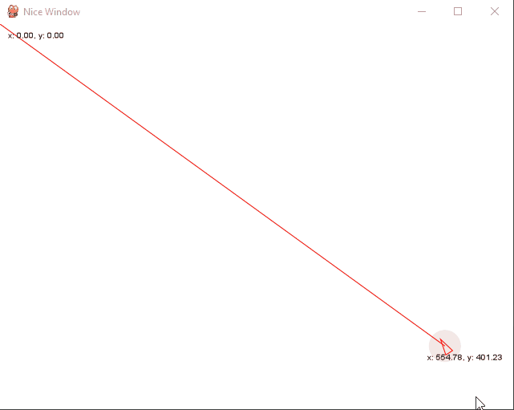

# Installation
    pip install gizeh
    pip install numpy
    pip install pygame

# Requirements
gizeh library needs GTK2. I found this version to fix the issues with gizeh.

    https://github.com/tschoonj/GTK-for-Windows-Runtime-Environment-Installer

# Random examples
#### Mouse follower

    python vectors/mouse_follower.py

